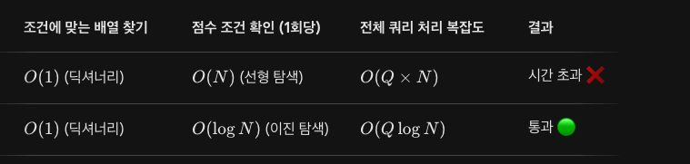

# 📝 오답 노트: 카카오 코딩테스트 '순위 검색'

---

## 1. 🌟 내가 잘했던 점 (Best Practice)

- **해시(Dictionary)를 활용한 완벽한 그룹화 설계**: 이 문제의 가장 큰 함정인 `"-"` (상관없음) 조건을 처리하기 위해, 지원자 1명당 가능한 **16가지의 모든 조건 조합**을 미리 만들어 딕셔너리의 키로 저장한 점은 정말 훌륭한 직관이었습니다.

- **탐색 시간 단축**: 만약 쿼리가 들어올 때마다 매번 전체 지원자를 훑으면서 조건을 비교했다면 조건 비교에만 엄청난 시간이 걸렸을 텐데, 딕셔너리를 사용함으로써 조건에 맞는 그룹을 찾는 시간을 $O(1)$로 단축시켰습니다.

---

## 2. 🚨 아쉬웠던 점 (Bottleneck & Mistake)

- **배열 내 점수 탐색 시 '선형 탐색(Linear Search)' 사용**: 딕셔너리에서 조건에 맞는 점수 리스트(`num_of_conditions[query_keys]`)를 잘 가져와 놓고, 정작 그 안에서 기준 점수(`query_score`) 이상인 사람을 찾을 때는 `for`문을 돌며 처음부터 끝까지 하나씩 확인했습니다.

- **효율성 테스트 실패 원인**: `query`의 크기가 최대 100,000이고, 특정 조건에 해당하는 지원자가 최대 50,000명일 수 있습니다. 이를 매번 선형 탐색하면 최악의 경우:

$$100{,}000 \times 50{,}000 = 5{,}000{,}000{,}000 \text{ (50억 번의 연산)}$$

→ 시간 초과(TLE)가 발생할 수밖에 없는 구조였습니다.

---

## 3. 🧠 활용한 핵심 알고리즘

| # | 알고리즘 | 역할 |
|---|----------|------|
| 1 | **해시 테이블** (Hash Table / Dictionary) | 조건 조합을 Key로, 점수 리스트를 Value로 묶어 조건 탐색 속도를 $O(1)$로 만듦 |
| 2 | **조합** (Combination) | 지원자의 정보 중 4가지 항목에 대해 각각 본래 값과 `"-"`를 가지는 $2^4 = 16$가지의 경우의 수를 전개 |
| 3 | **정렬** (Sorting — `.sort()`) | 점수 비교를 빠르게 하기 위해 배열을 한 번 오름차순 정렬 |
| 4 | **이진 탐색** (Binary Search — `bisect_left`) | 정렬된 배열에서 특정 값 이상의 원소 개수를 $O(\log n)$만에 찾기 위해 사용 |

---

## 4. ⏱️ 시간 복잡도 (Time Complexity) 변화

> - $N$: `info` 배열의 크기 (지원자 수, 최대 50,000)
> - $Q$: `query` 배열의 크기 (질문 수, 최대 100,000)

| 단계 | 방식 | 시간 복잡도 |
|------|------|------------|
| 전처리 (딕셔너리 구성) | 지원자 1명당 16가지 조합 생성 | $O(16N)$ = $O(N)$ |
| 각 리스트 정렬 | 딕셔너리 내 모든 점수 리스트 정렬 | $O(N \log N)$ |
| 쿼리 처리 (개선 전) | 선형 탐색 | $O(Q \times N)$ ❌ |
| 쿼리 처리 (개선 후) | 이진 탐색 (`bisect_left`) | $O(Q \times \log N)$ ✅ |

### 최종 시간 복잡도

$$O(N \log N + Q \log N)$$

