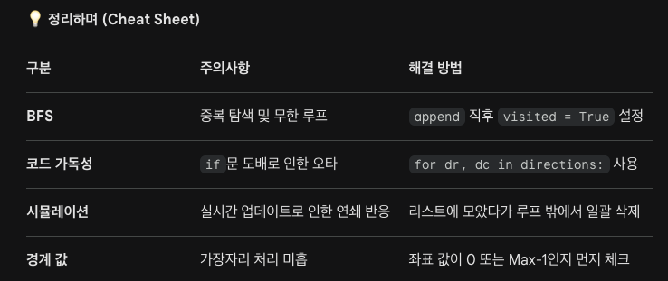

### 1. BFS 방문 처리 (visited)의 타이밍
- 실수했던 점: popleft() 이후에 방문 처리를 하거나, 상하좌우 탐색 시 본인의 visited 상태를 체크하는 등의 실수가 있었습니다.

- 정확한 원칙: **"큐에 넣을 때(append) 즉시 방문 처리"**를 해야 합니다.

- 그렇지 않으면 이미 큐에 대기 중인 좌표가 다른 경로를 통해 또 큐에 들어가는 중복 삽입이 발생합니다.

- 이는 큐의 크기를 폭발적으로 늘려 메모리 초과나 시간 초과의 주범이 됩니다.
```python
# ✅ 올바른 패턴
if not visited[nr][nc] and storage_arr[nr][nc] == ".":
    visited[nr][nc] = True  # 넣자마자 방문 표시!
    queue.append((nr, nc))
```


### 2. 효율적인 4방향 탐색 (방향 벡터 사용)
- 실수했던 점: if문을 상, 하, 좌, 우 4번 작성하면서 인덱스 오타(예: c-1 확인 중 visited[r][c] 체크 등)가 발생할 확률이 높았습니다.
- 정확한 원칙: dr, dc 리스트를 활용해 반복문으로 처리합니다. 코드가 간결해지고 오타 수정이 쉽습니다.
```python
# ✅ 방향 벡터 패턴
for dr, dc in [(-1, 0), (1, 0), (0, -1), (0, 1)]:
    nr, nc = r + dr, c + dc
    if 0 <= nr < row_len and 0 <= nc < col_len:
        # 여기에 이동 조건 작성
```

### 3. 일괄 삭제 (Batch Update) 원칙
- 실수했던 점: 컨테이너를 찾자마자 바로 .으로 바꾸면, 방금 지워진 칸이 통로가 되어 같은 단계에서 지워지면 안 되는 안쪽 컨테이너가 지워지는 논리적 오류가 발생합니다.
- 정확한 원칙: 한 번의 request 처리 기간 동안은 삭제 대상 좌표만 리스트(to_remove)에 모아두고, 탐색이 모두 끝난 뒤에 한꺼번에 업데이트합니다.

```python
# ✅ 일괄 처리 패턴
to_remove = []
for r in range(rows):
    for c in range(cols):
        if (삭제 조건 만족):
            to_remove.append((r, c))

for r, c in to_remove:
    storage_arr[r][c] = "."  # 마지막에 일괄 적용
```

